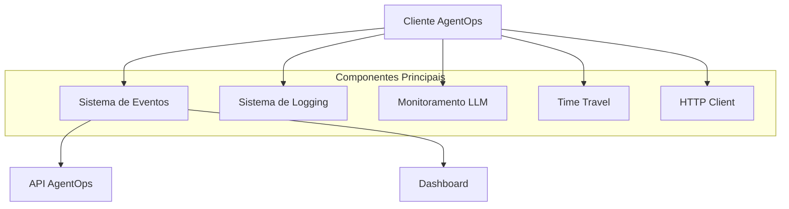
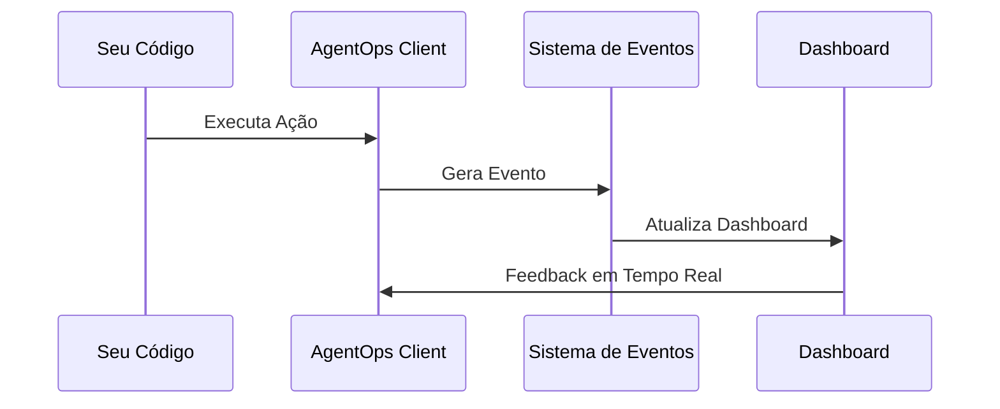

# Arquitetura e Configuração do AgentOps

[Ref: Classe `Client`, arquivo: agentops/client.py]
[Ref: Classe `Session`, arquivo: agentops/session.py]

## Arquitetura do Sistema



## Componentes Principais

### 1. Sistema de Eventos
[Ref: Classe `Event`, arquivo: agentops/event.py]
- Gerenciamento de eventos assíncronos
- Fila de eventos com prioridade
- Processamento em batch

### 2. Sistema de Logging
[Ref: Módulo `log_config`, arquivo: agentops/log_config.py]
- Configuração flexível de logs
- Níveis de log customizáveis
- Formatação estruturada

### 3. Time Travel
[Ref: Classe `TimeTravel`, arquivo: agentops/time_travel.py]
- Replay de eventos históricos
- Análise de sequências
- Depuração avançada

### 4. HTTP Client
[Ref: Classe `HTTPClient`, arquivo: agentops/http_client.py]
- Comunicação com API
- Retry com backoff
- Gestão de erros

## Configuração Principal

[Ref: Classe `Config`, arquivo: agentops/config.py]

### Configurações Básicas
- `api_key`: Chave de API para autenticação
- `endpoint`: URL da API (padrão: https://api.agentops.ai)
- `parent_key`: Chave opcional para hierarquia de projetos

### Configurações de Performance
- `max_wait_time`: Tempo máximo de espera (ms)
- `max_queue_size`: Tamanho máximo da fila de eventos
- `instrument_llm_calls`: Ativa/desativa instrumentação automática de LLMs
- `batch_size`: Tamanho do lote para envio de eventos
- `flush_interval`: Intervalo de flush automático

### Configurações de Sessão
- `auto_start_session`: Inicia sessão automaticamente
- `skip_auto_end_session`: Controla finalização automática
- `default_tags`: Tags padrão para eventos
- `session_ttl`: Tempo de vida da sessão

## Integração Básica

```python
from agentops import Client

# Inicialização básica
client = Client()
client.configure(
    api_key="sua_api_key",
    instrument_llm_calls=True,
    auto_start_session=True,
    batch_size=100,
    flush_interval=5000  # 5 segundos
)

# Configuração avançada com Time Travel
client.configure(
    time_travel_enabled=True,
    replay_session_id="session_123"
)

# Configuração de logging
client.configure(
    log_level="DEBUG",
    log_format="json"
)
```

## Gestão de Erros

[Ref: Módulo `exceptions`, arquivo: agentops/exceptions.py]

### Tipos de Exceções
- `AgentOpsError`: Erro base
- `ConfigurationError`: Erro de configuração
- `APIError`: Erro de comunicação com API
- `SessionError`: Erro de gestão de sessão

### Tratamento de Erros
```python
from agentops.exceptions import AgentOpsError

try:
    client.start_session()
except AgentOpsError as e:
    logger.error(f"Erro AgentOps: {e}")
```

## Singleton Pattern
[Ref: Módulo `singleton`, arquivo: agentops/singleton.py]

O AgentOps utiliza o padrão Singleton para garantir uma única instância do cliente por processo:

```python
# O mesmo cliente será retornado em diferentes partes do código
client1 = Client()
client2 = Client()
assert client1 is client2
```

## Sistema de Eventos

O AgentOps utiliza um sistema sofisticado de eventos para rastrear:

1. **LLM Events**: Chamadas a modelos de linguagem
2. **Tool Events**: Uso de ferramentas e utilitários
3. **Error Events**: Erros e exceções
4. **Action Events**: Ações genéricas

## Diagrama de Fluxo de Eventos



## Melhores Práticas

1. **Configuração**:
   - Sempre defina uma API key válida
   - Configure tags relevantes para seu caso de uso
   - Ajuste `max_wait_time` baseado em sua carga

2. **Monitoramento**:
   - Utilize eventos personalizados para casos específicos
   - Mantenha logging consistente
   - Monitore erros e exceções

3. **Performance**:
   - Ajuste `max_queue_size` conforme necessidade
   - Use tags para organizar eventos
   - Monitore uso de recursos
