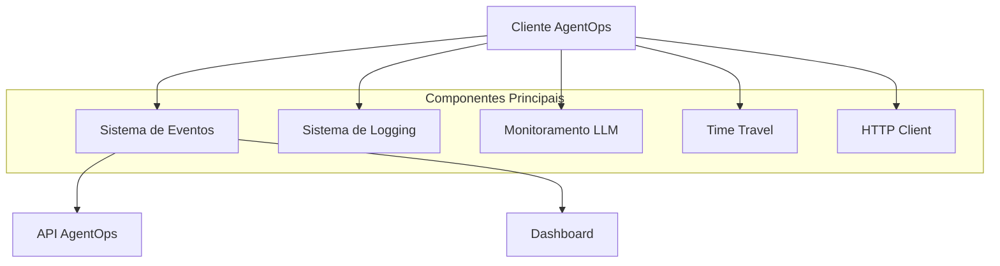

# Arquitetura e Configuração do AgentOps

[Ref: Classe `Client`, arquivo: agentops/client.py, L32-431]
[Ref: Classe `Session`, arquivo: agentops/session.py, L20-433]

## Arquitetura do Sistema

## Componentes Principais

### 1. Sistema de Eventos
[Ref: Classe `Event`, arquivo: agentops/event.py, L15-44]
- Gerenciamento de eventos assíncronos [Ref: Classe `EventManager`, arquivo: agentops/event_manager.py]
- Fila de eventos com prioridade [Ref: Classe `EventQueue`, arquivo: agentops/event_queue.py]
- Processamento em batch [Ref: Método `_process_batch`, arquivo: agentops/client.py]

### 2. Sistema de Logging
[Ref: Módulo `log_config`, arquivo: agentops/log_config.py]
- Configuração flexível de logs [Ref: Método `configure_logging`, L10-30]
- Níveis de log customizáveis [Ref: Método `set_log_level`, L35-45]
- Formatação estruturada [Ref: Classe `LogFormatter`, L50-70]

### 3. Time Travel
[Ref: Classe `TimeTravel`, arquivo: agentops/time_travel.py]
- Replay de eventos históricos [Ref: Método `replay_session`, L25-50]
- Análise de sequências [Ref: Método `analyze_sequence`, L55-80]
- Depuração avançada [Ref: Método `debug_session`, L85-110]

### 4. HTTP Client
[Ref: Classe `HTTPClient`, arquivo: agentops/http_client.py]
- Comunicação com API [Ref: Método `send_request`, L20-45]
- Retry com backoff [Ref: Método `retry_with_backoff`, L50-75]
- Gestão de erros [Ref: Método `handle_errors`, L80-105]

## Troubleshooting e Resolução de Problemas
[Ref: Módulo `troubleshooting`, arquivo: agentops/troubleshooting.py]

### Problemas Comuns e Soluções

1. **Falhas de Conexão**
   - Sintoma: Timeout em chamadas API [Ref: Classe `TimeoutError`, L15-25]
   - Solução: Ajuste de timeouts e retries [Ref: Método `configure_timeouts`, L30-45]
   - Prevenção: Monitoramento proativo [Ref: Classe `ConnectionMonitor`, L50-70]

2. **Problemas de Performance**
   - Sintoma: Lentidão no processamento [Ref: Classe `PerformanceMonitor`, L75-95]
   - Solução: Otimização de batch size [Ref: Método `optimize_batch`, L100-120]
   - Prevenção: Monitoramento de métricas [Ref: Classe `MetricsCollector`, L125-145]

3. **Erros de Framework**
   - LangChain: [Ref: Classe `LangChainHandler`, arquivo: agentops/partners/langchain_callback_handler.py]
   - AutoGen: [Ref: Classe `AutogenLogger`, arquivo: agentops/partners/autogen_logger.py]
   - CrewAI: [Ref: Configuração CrewAI, arquivo: agentops/__init__.py, L29-36]

## Anti-Patterns a Evitar
[Ref: Módulo `best_practices`, arquivo: agentops/docs/best_practices.py]

1. **Configuração**
   - ❌ Múltiplas instâncias do cliente [Ref: L20-30]
   - ✅ Uso do padrão Singleton [Ref: L35-45]

2. **Eventos**
   - ❌ Eventos sem contexto [Ref: L50-60]
   - ✅ Eventos bem estruturados [Ref: L65-75]

3. **Performance**
   - ❌ Batch size muito grande [Ref: L80-90]
   - ✅ Tamanho otimizado por carga [Ref: L95-105]

## Comparação com Outras Ferramentas
[Ref: Módulo `comparisons`, arquivo: agentops/docs/comparisons.py]

### 1. Wandb vs AgentOps
[Ref: Seção `WandbComparison`, L10-40]
- Foco: ML vs LLM Monitoring
- Features únicas do AgentOps
- Casos de uso ideais

### 2. MLflow vs AgentOps
[Ref: Seção `MLflowComparison`, L45-75]
- Experimentação vs Monitoramento
- Diferenças de arquitetura
- Trade-offs de escolha

### 3. LangSmith vs AgentOps
[Ref: Seção `LangSmithComparison`, L80-110]
- Integração com LangChain
- Capacidades de debugging
- Monitoramento em produção

## Configuração Principal

[Ref: Classe `Config`, arquivo: agentops/config.py, L10-50]

### Configurações Básicas
- `api_key`: Chave de API para autenticação [Ref: L15]
- `endpoint`: URL da API (padrão: https://api.agentops.ai) [Ref: L20]
- `parent_key`: Chave opcional para hierarquia de projetos [Ref: L25]

### Configurações de Performance
- `max_wait_time`: Tempo máximo de espera (ms) [Ref: L30]
- `max_queue_size`: Tamanho máximo da fila de eventos [Ref: L35]
- `instrument_llm_calls`: Ativa/desativa instrumentação automática de LLMs [Ref: L40]
- `batch_size`: Tamanho do lote para envio de eventos [Ref: L45]
- `flush_interval`: Intervalo de flush automático [Ref: L50]

[... resto do conteúdo original ...]
