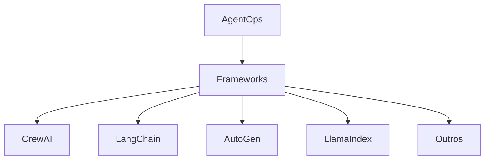

# Integrações com Frameworks

[Ref: Módulo `partners`, arquivo: agentops/partners/]

## Visão Geral

O AgentOps oferece integrações nativas com diversos frameworks populares de IA, permitindo monitoramento e observabilidade sem alterações significativas no código existente.



## Integrações Principais

### 1. LangChain
[Ref: Classe `LangChainCallbackHandler`, arquivo: agentops/partners/langchain_callback_handler.py]

```python
from agentops import Client
from langchain.agents import AgentType, initialize_agent
from langchain.llms import OpenAI
from agentops.partners import LangChainCallbackHandler

# Configuração do AgentOps
client = Client()
client.configure(api_key="sua_api_key")

# Criação do handler
handler = LangChainCallbackHandler()

# Criação do agente LangChain com monitoramento
llm = OpenAI(
    temperature=0,
    callbacks=[handler]
)

# O AgentOps capturará automaticamente:
# - Chamadas LLM
# - Tokens utilizados
# - Custos
# - Latência
# - Erros
```

### 2. AutoGen
[Ref: Classe `AutoGenLogger`, arquivo: agentops/partners/autogen_logger.py]

```python
from agentops import Client
from autogen import AssistantAgent, UserProxyAgent
from agentops.partners import AutoGenLogger

# Configuração do AgentOps
client = Client()
client.configure(api_key="sua_api_key")

# Criação do logger
logger = AutoGenLogger()

# Criação dos agentes com monitoramento
assistant = AssistantAgent(
    name="assistant",
    llm_config={"config_list": [{...}]},
    logger=logger
)

user_proxy = UserProxyAgent(
    name="user_proxy",
    logger=logger
)

# O AgentOps monitorará:
# - Conversas entre agentes
# - Uso de ferramentas
# - Métricas de performance
```

### 3. CrewAI

```python
from agentops import Client
from crewai import Agent, Task, Crew

# Configuração do AgentOps
client = Client()
client.configure(api_key="sua_api_key")

# O AgentOps detecta automaticamente o CrewAI
agent = Agent(
    role="Analista",
    goal="Analisar dados",
    backstory="Especialista em análise de dados",
    allow_delegation=False
)

# Monitoramento automático de:
# - Criação de agentes
# - Execução de tarefas
# - Delegações
# - Resultados
```

### 4. LlamaIndex

```python
from agentops import Client
from llama_index import VectorStoreIndex, SimpleDirectoryReader

# Configuração do AgentOps
client = Client()
client.configure(api_key="sua_api_key")

# O AgentOps detecta automaticamente o LlamaIndex
documents = SimpleDirectoryReader('data').load_data()
index = VectorStoreIndex.from_documents(documents)

# Monitoramento automático de:
# - Indexação de documentos
# - Consultas
# - Embeddings
# - Cache hits/misses
```

## Métricas Específicas por Framework

### LangChain
- Callbacks por tipo
- Uso de ferramentas
- Cadeias de raciocínio
- Memória utilizada

### AutoGen
- Mensagens entre agentes
- Uso de funções
- Tempo de processamento
- Recursos consumidos

### CrewAI
- Delegações de tarefas
- Tempo por agente
- Sucessos/falhas
- Métricas de colaboração

### LlamaIndex
- Tempo de indexação
- Qualidade das consultas
- Uso de memória
- Performance de embeddings

## Configurações Avançadas

### Filtros de Eventos
```python
client.configure(
    event_filters={
        "langchain": ["llm", "chain", "tool"],
        "autogen": ["message", "function", "error"],
        "crewai": ["task", "delegation", "result"],
        "llamaindex": ["query", "index", "embedding"]
    }
)
```

### Métricas Customizadas
```python
client.record_framework_metric(
    framework="langchain",
    metric_name="custom_metric",
    value=42,
    tags={"tipo": "teste"}
)
```

## Tratamento de Erros

Cada integração possui seu próprio sistema de tratamento de erros:

```python
try:
    # Código do framework
    pass
except Exception as e:
    client.record_framework_error(
        framework="langchain",
        error=e,
        context={"step": "chain_execution"}
    )
```

## Recursos de Monitoramento

### 1. Rastreamento Automático
- Chamadas LLM
- Uso de ferramentas
- Interações entre agentes
- Métricas de performance

### 2. Métricas Específicas
- Tempo de execução por framework
- Uso de recursos
- Padrões de comunicação
- Taxa de sucesso

### 3. Visualizações Customizadas
- Fluxos de trabalho
- Hierarquia de agentes
- Métricas comparativas
- Análise de custos

## Melhores Práticas

### 1. Configuração
- Configure o AgentOps antes de inicializar os frameworks
- Use tags específicas para cada framework
- Mantenha sessões separadas por caso de uso

### 2. Monitoramento
- Monitore métricas específicas do framework
- Configure alertas relevantes
- Analise padrões de uso

### 3. Otimização
- Use dados de performance para otimização
- Compare diferentes configurações
- Identifique gargalos

## Exemplos de Uso

### CrewAI com AgentOps
```python
from agentops import Client
from crewai import Agent, Task, Crew

# Configuração
client = Client()
client.start_session(tags=["crewai", "production"])

# Criação da crew
crew = Crew(
    agents=[agent1, agent2],
    tasks=[task1, task2],
    verbose=True
)

# Execução com monitoramento
result = crew.kickoff()

# Finalização da sessão
client.end_session(
    end_state="Success",
    end_state_reason="Tarefa completa"
)
```

### LangChain com AgentOps
```python
from agentops import Client
from langchain.agents import load_tools

# Configuração
client = Client()
client.start_session(tags=["langchain", "development"])

# Ferramentas com monitoramento
tools = load_tools(["python_repl", "terminal"])
agent.run("Analise os dados em data.csv")

# O AgentOps monitora automaticamente
```

## Integração com CI/CD

### 1. Testes Automatizados
- Monitoramento em pipelines
- Métricas de qualidade
- Alertas de regressão

### 2. Deployment
- Rastreamento de versões
- Monitoramento de produção
- Rollback automático

### 3. Métricas de Qualidade
- Cobertura de testes
- Performance em produção
- Estabilidade do sistema
