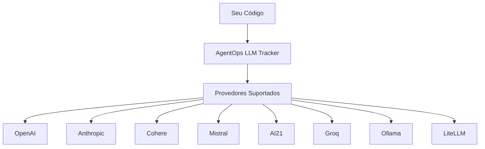

# Sistema de Monitoramento de LLMs

[Ref: Módulo `llms`, arquivo: agentops/llms/]

## Visão Geral

O AgentOps fornece um sistema robusto de monitoramento para diversos provedores de LLM (Large Language Models), permitindo rastreamento automático de todas as interações com modelos de linguagem.

[Ref: Classe `LlmTracker`, arquivo: agentops/llms/__init__.py]



## Provedores Suportados

### 1. OpenAI
[Ref: Classe `OpenAiProvider`, arquivo: agentops/llms/openai.py]
- Versão Suportada: 1.0.0+
- Funcionalidades:
  - Chat Completions
  - Streaming
  - Async Support
  - Function Calling
  - Vision Support
  - Tools/Plugins

### 2. Anthropic
[Ref: Classe `AnthropicProvider`, arquivo: agentops/llms/anthropic.py]
- Versão Suportada: 0.32.0+
- Funcionalidades:
  - Claude Completions
  - Streaming Support
  - System Messages
  - Tool Use

### 3. Cohere
[Ref: Classe `CohereProvider`, arquivo: agentops/llms/cohere.py]
- Versão Suportada: 5.4.0+
- Funcionalidades:
  - Chat
  - Chat Stream
  - Embeddings
  - Rerank

### 4. Mistral
[Ref: Classe `MistralProvider`, arquivo: agentops/llms/mistral.py]
- Versão Suportada: 1.0.1+
- Funcionalidades:
  - Chat Complete
  - Streaming
  - Embeddings

### 5. AI21
[Ref: Classe `AI21Provider`, arquivo: agentops/llms/ai21.py]
- Versão Suportada: 2.0.0+
- Funcionalidades:
  - Text Generation
  - Fast Generation
  - Custom Models

### 6. Groq
[Ref: Classe `GroqProvider`, arquivo: agentops/llms/groq.py]
- Versão Suportada: 0.9.0+
- Funcionalidades:
  - Chat Complete
  - Streaming
  - Low Latency

### 7. Ollama
[Ref: Classe `OllamaProvider`, arquivo: agentops/llms/ollama.py]
- Versão Suportada: 0.0.1+
- Funcionalidades:
  - Local Models
  - Custom Models
  - Embeddings

### 8. LiteLLM
[Ref: Classe `LiteLLMProvider`, arquivo: agentops/llms/litellm.py]
- Versão Suportada: 1.3.1+
- Funcionalidades:
  - Multi-provider Support
  - Fallbacks
  - Load Balancing

## Métricas Monitoradas

### Métricas Padrão
[Ref: Classe `LLMEvent`, arquivo: agentops/event.py]

```python
# Exemplo de evento LLM
{
    "provider": "openai",
    "model": "gpt-4",
    "tokens": {
        "prompt": 150,
        "completion": 50,
        "total": 200
    },
    "latency": 2.5,
    "cost": 0.03,
    "success": true
}
```

### Métricas Avançadas
- Razão de Compressão de Tokens
- Taxa de Erro por Modelo
- Distribuição de Latência
- ROI por Modelo

## Configuração de Monitoramento

```python
from agentops import Client

client = Client()
client.configure(
    api_key="sua_api_key",
    llm_config={
        "providers": ["openai", "anthropic"],
        "track_tokens": True,
        "track_costs": True,
        "track_latency": True
    }
)
```

## Interceptação Automática

O AgentOps intercepta automaticamente chamadas aos LLMs:

```python
from openai import OpenAI
import anthropic

# OpenAI é interceptado automaticamente
openai_client = OpenAI()
response = openai_client.chat.completions.create(
    model="gpt-4",
    messages=[{"role": "user", "content": "Olá!"}]
)

# Anthropic também é interceptado
claude = anthropic.Anthropic()
message = claude.messages.create(
    model="claude-3-opus-20240229",
    messages=[{"role": "user", "content": "Olá!"}]
)
```

## Customização de Monitoramento

### Filtros de Eventos
```python
client.configure(
    llm_filters={
        "openai": ["gpt-4", "gpt-3.5-turbo"],
        "anthropic": ["claude-3"],
        "cohere": ["command", "command-light"]
    }
)
```

### Métricas Customizadas
```python
client.record_llm_metric(
    provider="openai",
    metric_name="business_value",
    value=100,
    tags={"use_case": "support"}
)
```

## Tratamento de Erros

```python
try:
    response = openai_client.chat.completions.create(
        model="gpt-4",
        messages=[{"role": "user", "content": "Olá!"}]
    )
except Exception as e:
    client.record_llm_error(
        provider="openai",
        error=e,
        context={"step": "chat_completion"}
    )
```

## Boas Práticas

1. **Configuração Inicial**
   - Configure todos os provedores no início
   - Defina limites de custo
   - Estabeleça timeouts

2. **Monitoramento**
   - Use tags para categorizar chamadas
   - Monitore custos em tempo real
   - Configure alertas

3. **Otimização**
   - Analise métricas regularmente
   - Ajuste modelos com base no ROI
   - Implemente caching quando possível
