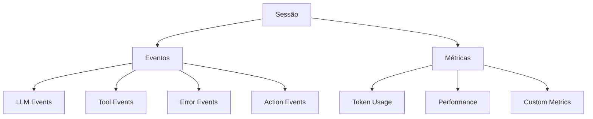

# Sistema de Monitoramento do AgentOps

## Visão Geral

O AgentOps fornece um sistema completo de monitoramento através de sessões, eventos e métricas, permitindo rastrear e analisar todas as operações de seus agentes.



## Sistema de Sessões

[Ref: Classe `Session`, arquivo: agentops/session.py]

### Estrutura da Sessão
- **ID Único**: Cada sessão possui um identificador UUID
- **Timestamps**: Início e fim da sessão
- **Estado Final**: Success, Fail ou Indeterminate
- **Tags**: Para categorização e filtragem
- **Métricas**: Contadores e custos

### Configuração de Sessão
```python
from agentops import Client

client = Client()
client.start_session(
    tags=["production", "test"],
    custom_metrics={"ambiente": "desenvolvimento"}
)
```

## Sistema de Eventos

[Ref: Módulo `event.py`, arquivo: agentops/event.py]

### Tipos de Eventos
1. **LLM Events**
   [Ref: Classe `LLMEvent`, arquivo: agentops/event.py]
   - Chamadas a modelos de linguagem
   - Métricas de tokens
   - Tempos de resposta

2. **Tool Events**
   [Ref: Classe `ToolEvent`, arquivo: agentops/event.py]
   - Uso de ferramentas
   - Parâmetros e resultados
   - Performance

3. **Error Events**
   [Ref: Classe `ErrorEvent`, arquivo: agentops/event.py]
   - Exceções e erros
   - Evento de origem
   - Detalhes do erro

4. **Action Events**
   [Ref: Classe `ActionEvent`, arquivo: agentops/event.py]
   - Ações customizadas
   - Parâmetros e resultados
   - Logs de execução

### Registro de Eventos
[Ref: Método `record`, arquivo: agentops/session.py]
```python
# Registro manual de eventos
client.record_action(
    action_type="custom_action",
    params={"param1": "value1"},
    returns={"result": "success"}
)

# Registro automático
@record_action(action_type="process_data")
def process_data(data):
    return data.process()
```

## Sistema de Métricas

[Ref: Classe `Session`, arquivo: agentops/session.py]

### Métricas Padrão
- **Token Usage**: Contagem de tokens por modelo
- **Latência**: Tempo de resposta de chamadas
- **Custos**: Custos por modelo e total
- **Contadores de Eventos**: Total por tipo

### Métricas Customizadas
```python
client.start_session(
    custom_metrics={
        "ambiente": "producao",
        "versao": "1.0.0",
        "tipo_execucao": "batch"
    }
)
```

## Dashboard de Monitoramento

[Ref: Documentação do Dashboard, arquivo: agentops_documentacao/dashboard/01_configuracao_dashboard.md]

### Visualizações Disponíveis
1. **Visão Geral**
   - Total de sessões
   - Eventos por tipo
   - Taxa de sucesso

2. **Performance**
   - Tempo médio de resposta
   - Uso de tokens por modelo
   - Custos acumulados

3. **Análise de Erros**
   - Tipos de erro mais comuns
   - Taxa de erro por ferramenta
   - Tendências de erro

4. **Métricas Customizadas**
   - Gráficos configuráveis
   - Filtros por tags
   - Exportação de dados

## Melhores Práticas

### 1. Organização
- Use tags consistentes
- Mantenha sessões focadas
- Documente eventos importantes

### 2. Monitoramento
- Configure alertas relevantes
- Monitore custos regularmente
- Analise padrões de uso

### 3. Performance
- Otimize baseado em métricas
- Monitore uso de recursos
- Identifique gargalos

### 4. Troubleshooting
- Use logs detalhados
- Mantenha contexto de erros
- Implemente retry policies

## Integração com Ferramentas Externas

### 1. Logging
- Integração com sistemas de log
- Export de dados
- Análise histórica

### 2. Alertas
- Configuração de thresholds
- Notificações
- Ações automáticas

### 3. Analytics
- Export para BI tools
- Análise customizada
- Relatórios automáticos
