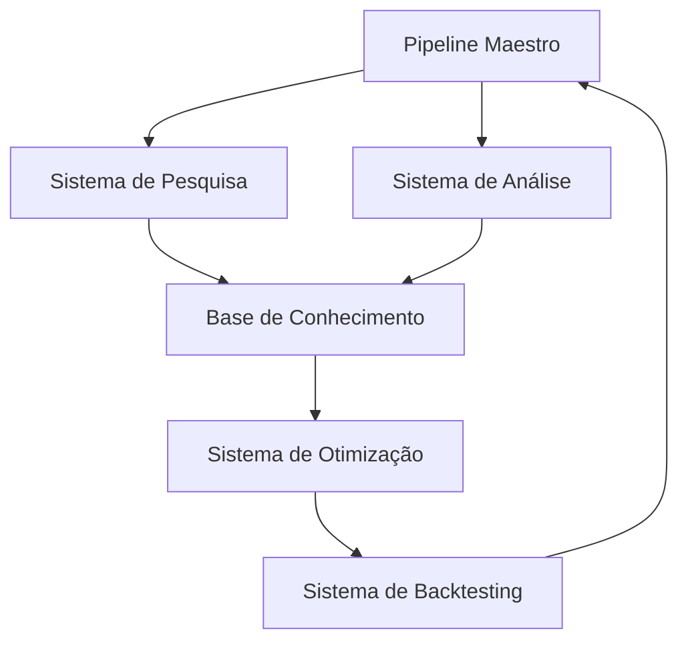

# Sistema de Trading Autônomo - Arquitetura do Sistema

## 1. Visão Geral da Arquitetura

### Componentes Principais
1. Pipeline Maestro (Orquestrador)
2. Sistema de Pesquisa Científica
3. Sistema de Análise Quantitativa
4. Sistema de Backtesting
5. Base de Conhecimento
6. Sistema de Otimização

### Fluxo de Dados

## 2. Componentes Detalhados

### Pipeline Maestro
- Orquestração de todos os componentes
- Gerenciamento de estados
- Tomada de decisão estratégica
- Controle de fluxo adaptativo

### Sistema de Pesquisa Científica
- Integração com arXiv
- Análise de papers
- Extração de modelos matemáticos
- Classificação de relevância

### Sistema de Análise Quantitativa
- Análise técnica
- Análise fundamental
- Análise estatística
- Modelagem matemática

### Sistema de Backtesting
- Integração com VectorBT.pro
- Simulação de estratégias
- Análise de performance
- Validação de modelos

### Base de Conhecimento
- Armazenamento de pesquisas
- Catálogo de estratégias
- Métricas de performance
- Modelos matemáticos

### Sistema de Otimização
- Otimização de parâmetros
- Ajuste de modelos
- Calibração de estratégias
- Validação cruzada

## 3. Interfaces e Comunicação

### APIs Internas
- REST APIs entre componentes
- Websockets para dados em tempo real
- Filas de mensagens para processamento assíncrono

### Protocolos de Comunicação
- JSON para troca de dados
- Protocol Buffers para dados binários
- WebSocket para streaming

## 4. Requisitos Técnicos

### Hardware Recomendado
- CPU: 8+ cores
- RAM: 32GB+
- Storage: SSD 500GB+
- GPU: Opcional para ML

### Software e Dependências
- Python 3.8+
- CrewAI
- VectorBT.pro
- PostgreSQL
- Redis
- Docker
